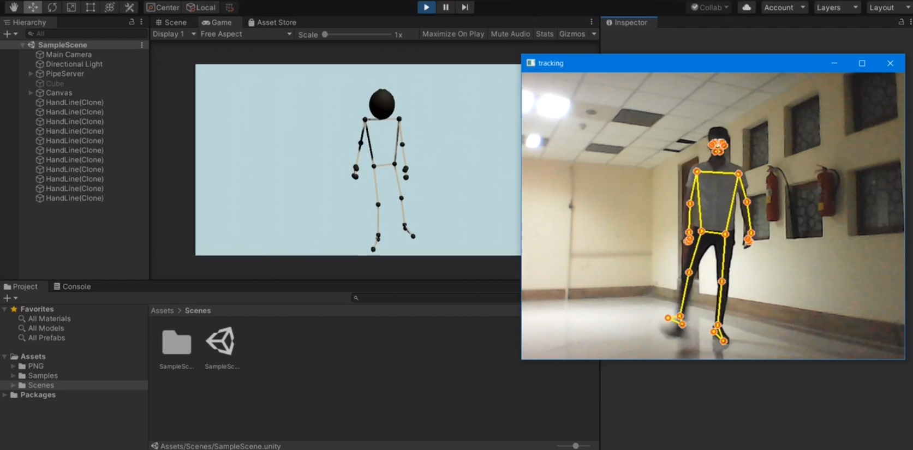

# Link Between Python and Unity

A real-time bridge between Python and Unity using **MediaPipe**, **OpenCV**, and named pipes. This project enables seamless integration of pose detection from Python to Unity, allowing real-time body movement tracking for interactive applications.

---

## Features

- **Pose Detection**: Tracks 33 key body landmarks in real-time using MediaPipe's Pose solution.
- **Unity Integration**: Transmits pose data to Unity via a named pipe for real-time visualization and interaction.
- **Efficient Multithreading**: Manages video capture and pose processing in parallel for smooth performance.
- **Customizable Parameters**: Configure resolution, frame rate, and model complexity as per your requirements.

---

## Preview  

### Pose Detection Screenshot:  
  

### Unity Integration Video:  
  

---

## Installation

### Prerequisites
Ensure Python 3.8+ is installed along with the following libraries:

- OpenCV
- MediaPipe
- NumPy

### Steps

1. Clone the repository:
   ```bash
   git clone https://github.com/amin-Lotfi/link-between-python-and-unity.git
   cd link-between-python-and-unity
   ```

2. Install dependencies:
   ```bash
   pip3 install -r requirements.txt
   ```

3. Run the Python script:
   ```bash
   python main.py
   ```

---

## Usage

1. **Start Detection**:
   - Launch the script to start detecting body movements from your webcam.
   - Pose data will be visualized in Python and sent to Unity.

2. **Unity Integration**:
   - Ensure Unity is set up to receive data via the named pipe.
   - Visualize real-time pose data in your Unity application.

3. **Exit**:
   - Press the `q` key to stop the Python script.

---

## File Structure
```
link-between-python-and-unity/
├── image/
│   ├── pose-detection-preview.jpg
│   ├── unity-integration-demo.mp4
├── main.py
├── README.md
└── requirements.txt
```

---

## Contributing

Contributions are welcome! Fork the repository, create a feature branch, and submit a pull request to help improve the project.

---

## Contact

For inquiries or support, reach out via:

- **Email**: aminlotfi.ogl@gmail.com
- **GitHub**: [amin-Lotfi](https://github.com/amin-Lotfi)
